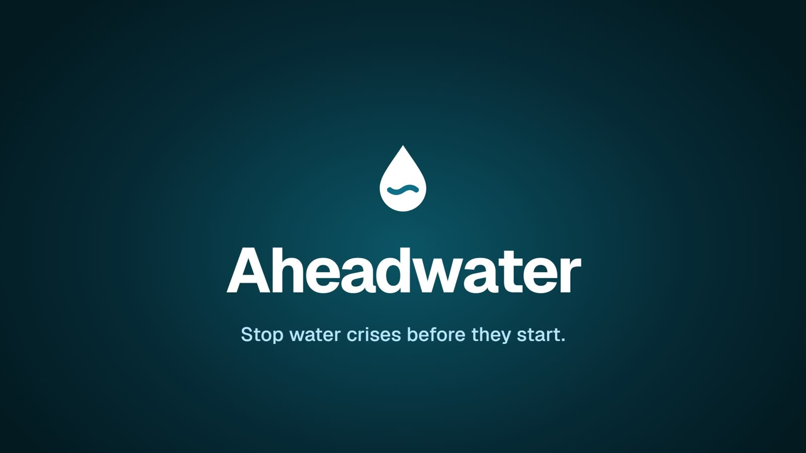
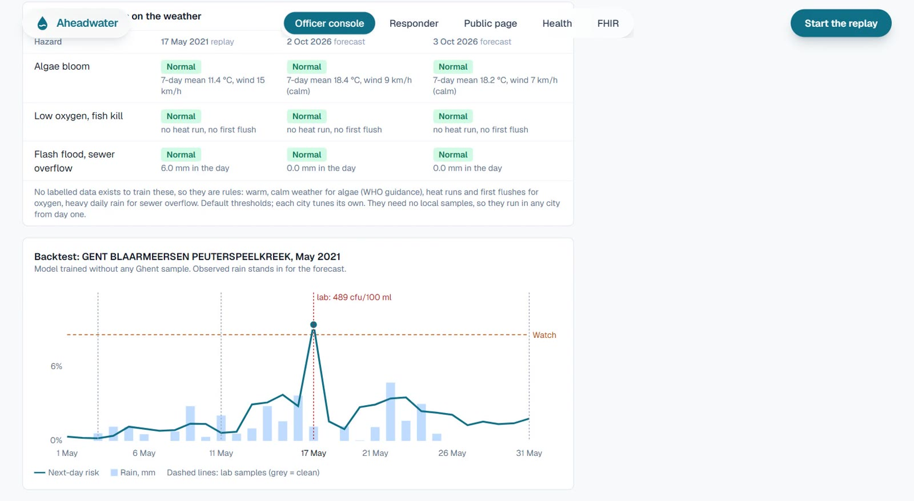
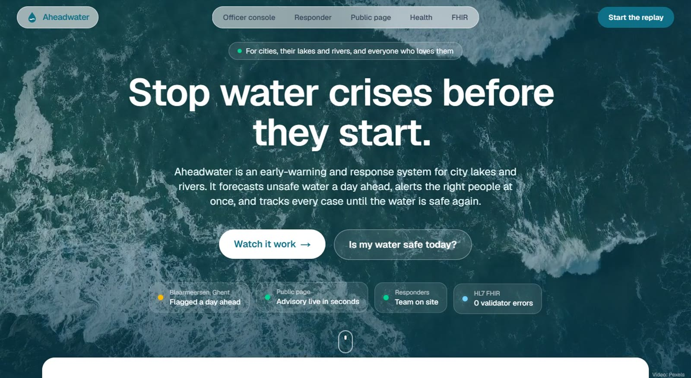
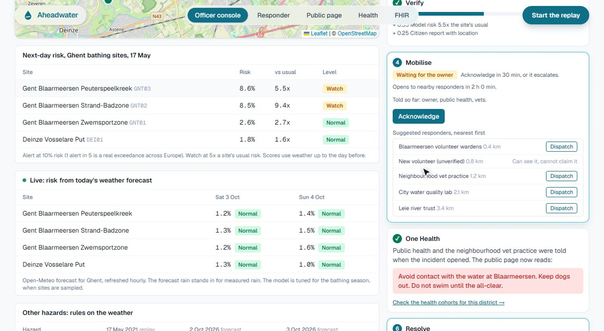
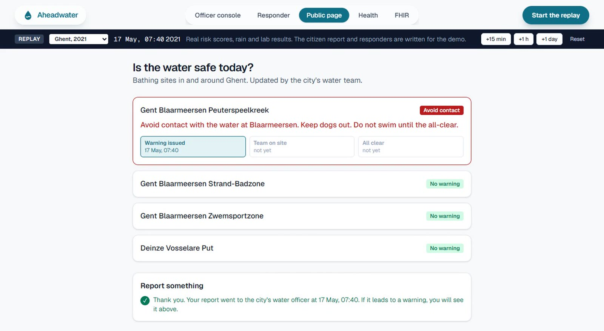
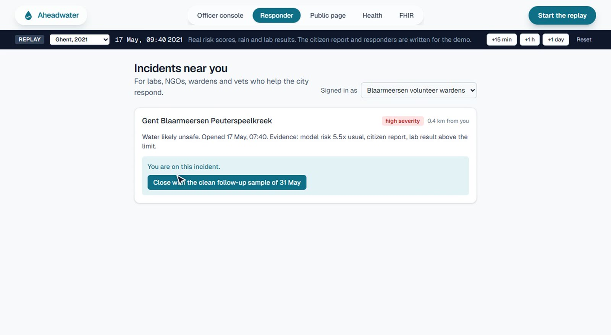
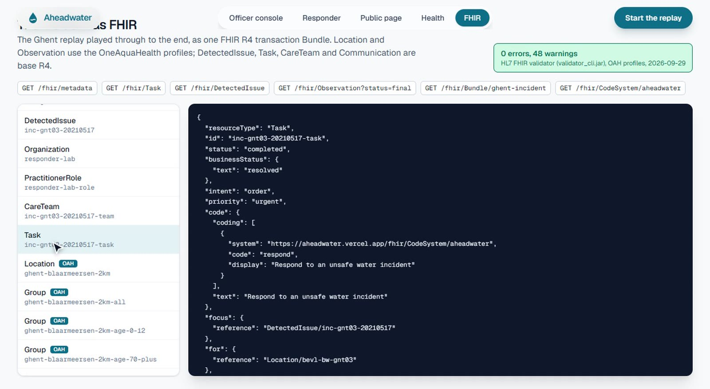
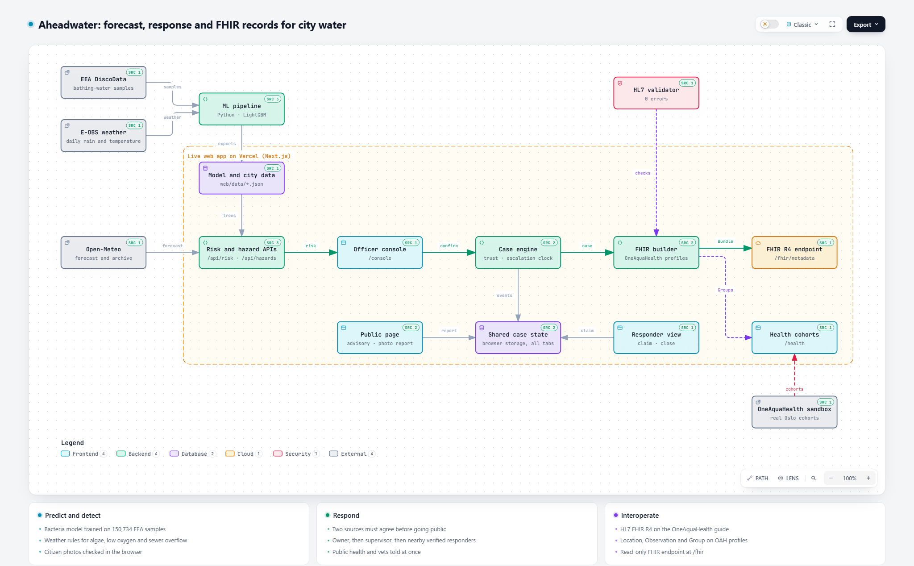

<p align="center">
  
</p>

<h1 align="center">Aheadwater</h1>

<p align="center"><strong>Stop water crises before they start.</strong></p>

<p align="center">
  An early-warning and response system for city lakes and rivers.<br />
  It forecasts unsafe water a day ahead, alerts the right people at once,<br />
  and follows every case until the water is safe again.
</p>

<p align="center">
  <a href="https://aheadwater.vercel.app"></a>
  <a href="https://youtu.be/v87ago6cD8k"></a>
  <a href="https://aheadwater.vercel.app/fhir/metadata"></a>
</p>

<p align="center">
  
  
  
  
</p>

---

## Watch the demo

<p align="center">
  <a href="https://youtu.be/v87ago6cD8k">
    
  </a>
  <br />
  <sub>Click to watch the 4:54 demo on YouTube: the problem, the six steps, every screen of the app, two real cities, and what comes next.</sub>
</p>

## Why it matters

Unsafe water, sanitation and hygiene cost **1.4 million lives** worldwide in a single year, **about 498,000 in India** and **more than 33,000 across Europe** (WHO, 2019 figures). Every warning that reaches people a day earlier is a chance to keep them safe.

City water can change fast. A storm can push sewage into a lake overnight. A heatwave can bring algae blooms and drain the oxygen. Floods and spills arrive without warning. A lab can confirm a problem, but the result takes a day or more, and the water team, the health service, labs and volunteers each hear about it in a different place.

**Aheadwater gives everyone the same picture, a day ahead.**

## How it works

| | Step | What happens |
|---|---|---|
| 📈 | **Predict** | A model trained on 150,734 bathing-water samples from 7,246 lakes and rivers in 27 countries reads tomorrow's weather and scores every site. Weather rules watch for algae blooms, low oxygen and sewer overflow in any city from day one. |
| 🔎 | **Detect** | The forecast, lab results, hazard rules and reports from people at the water all arrive in one console. A citizen's photo is checked on their own phone for light, focus and open water before it is sent. |
| ✅ | **Verify** | Each case gets a trust score from the sources behind it. Two sources must agree before anything goes public. |
| 🧑‍🤝‍🧑 | **Act** | The city's water officer owns the case. Public health and local vets hear at once. If the owner does not acknowledge in 30 minutes it reaches their supervisor; after two hours, nearby verified labs, groups and volunteers can take it. |
| 🛡️ | **Resolve** | The team closes the case with evidence, and the public page shows every step from the first warning to the all-clear. |
| 🔁 | **Learn** | A closed case with a dated lab sample becomes a new labelled example, so each city's forecast keeps getting sharper. |

Every step is stored as **HL7 FHIR R4** on the **OneAquaHealth implementation guide**, so hospitals, labs and city systems can read a case directly.

## Proven on a real day

On the morning of **17 May 2021**, after a wet weekend in Ghent, Aheadwater rated Blaarmeersen lake at **5.5 times its usual risk**. The lab sample taken that day came back over the limit. The model behind that score had never seen a single Ghent sample.

<p align="center"></p>

Across Europe, on sites the model never saw during training, its alerts are right **ten times more often than chance** (1 in 5, against 1 in 50; ROC-AUC 0.79). Trained on 2020 to 2023 and tested on 2024, it holds up (ROC-AUC 0.77). Full figures are in [`web/data/metrics.json`](web/data/metrics.json).

## See it in action

| Landing page | Officer console |
|---|---|
|  |  |
| **Public page** | **Responder view** |
|  |  |

<p align="center"></p>

## Architecture

<picture>
  <source media="(prefers-color-scheme: dark)" srcset="docs/assets/architecture-dark.png" />
  
</picture>

Every box links to the source that implements it. Download [`docs/architecture.html`](docs/architecture.html) and open it in a browser for the interactive version.

## Try it

Open **[aheadwater.vercel.app](https://aheadwater.vercel.app)**. Put the console, the responder view and the public page in three tabs: they share one live case.

| Page | What you can do |
|---|---|
| [`/console`](https://aheadwater.vercel.app/console) | See tomorrow's risk on the map, the hazard rules and the Ghent backtest; confirm a case, run the escalation clock, dispatch a team, close and learn |
| [`/public`](https://aheadwater.vercel.app/public) | Check whether the water is safe today and send a report with a photo |
| [`/responder`](https://aheadwater.vercel.app/responder) | Claim a case near you, attach the lab result and close it |
| [`/health`](https://aheadwater.vercel.app/health) | See the cohorts public health watches, and the same query on real Oslo data |
| [`/fhir-explorer`](https://aheadwater.vercel.app/fhir-explorer) | Read every FHIR resource in the case |
| [`/fhir/metadata`](https://aheadwater.vercel.app/fhir/metadata) | Query the read-only FHIR R4 endpoint from any FHIR tool |

**Two cities, two real days.** Pick a city in the clock bar:

- **Ghent, May 2021.** The forecast flags Blaarmeersen lake after a wet weekend, and the lab confirms it the same day.
- **Bengaluru, August 2017.** After the heaviest August rain in 127 years (as reported by NDTV), foam from Varthur Lake spilled onto the road. A citizen report and CPCB monitoring open the case, and the same workflow carries it through. Prediction switches on there as local samples come in.

## Built with

| Layer | What |
|---|---|
| App | Next.js 16, React 19, Tailwind CSS 4, Motion, Lenis, Leaflet and OpenStreetMap, on Vercel |
| Model | Python, pandas, xarray, LightGBM, scikit-learn; exported trees scored in TypeScript |
| Standards | HL7 FHIR R4, OneAquaHealth implementation guide (`hl7.eu.fhir.oah`), checked with the official HL7 validator |
| In the browser | MobileNet v2 (TensorFlow.js) for the photo check |
| Data | European Environment Agency, E-OBS, Open-Meteo, CPCB, OneAquaHealth sandbox |

## Run it yourself

```sh
cd web
npm install
npm run dev          # http://localhost:3000
npm test             # 30 tests: model parity with Python, features, escalation, FHIR, hazards, photo checks, trust
```

Train the model:

```sh
cd ml
python -m venv .venv
.venv/Scripts/pip install -r requirements.txt   # bin/pip on macOS and Linux
python fetch.py      # EEA sites and samples
python features.py   # training table (needs the E-OBS grids below)
python train.py      # model and metrics
python export.py     # Ghent data and the backtest for the app
pytest
```

E-OBS weather grids go in `ml/data/raw/`:
[`rr.nc`](https://knmi-ecad-assets-prd.s3.amazonaws.com/ensembles/data/Grid_0.25deg_reg_ensemble/rr_ens_mean_0.25deg_reg_2011-2025_v33.0e.nc) and
[`tg.nc`](https://knmi-ecad-assets-prd.s3.amazonaws.com/ensembles/data/Grid_0.25deg_reg_ensemble/tg_ens_mean_0.25deg_reg_2011-2025_v33.0e.nc).

Validate the FHIR records against the OneAquaHealth profiles: see [`fhir/README.md`](fhir/README.md). Rebuild the demo video: `video/tts.py`, then `video/build.py`.

## What comes next

- **Live sensors** and city lab feeds flowing straight into the console.
- **A trained forecast for every hazard**, algae, oxygen and overflow, as local data grows.
- **A shared standard**: the incident and citizen-report profiles offered to the OneAquaHealth guide.
- **The next cities**, each onboarded on the same code.

## Data and credits

- Bathing-water samples: European Environment Agency, WISE Bathing Water Directive dataset, via DiscoData.
- Weather: E-OBS v33.0e (Cornes et al., 2018), Copernicus Climate Change Service and ECA&D; Open-Meteo for forecasts.
- Health cohorts: OneAquaHealth FHIR sandbox, HL7 Europe.
- Bengaluru lakes: Central Pollution Control Board, National Water Quality Monitoring Programme 2016 and 2017; bathing criteria from Schedule I, item 93 of the Environment (Protection) Rules.
- Deaths figures: WHO, *Burden of disease attributable to unsafe drinking-water, sanitation and hygiene, 2019 update* (2023); WHO Global Health Observatory, SDG 3.9.2; WHO/Europe.
- Landing page and video: ocean footage from Pexels; wave sound "Ocean Waves on a Tropical Beach" (CC0, Wikimedia Commons); Blaarmeersen photo by Ravindra Hegade (CC BY-SA 4.0, Wikimedia Commons).

The brief and every design decision are in [`project.md`](project.md); where things stand is in [`state.md`](state.md).
